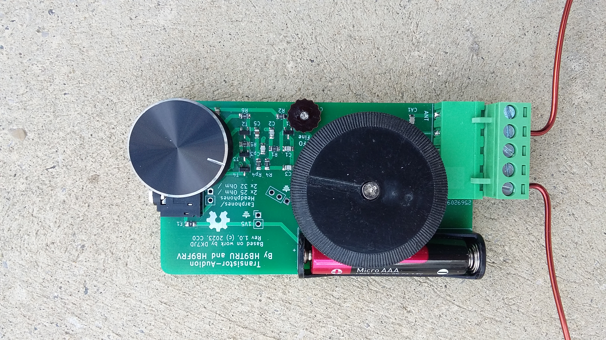
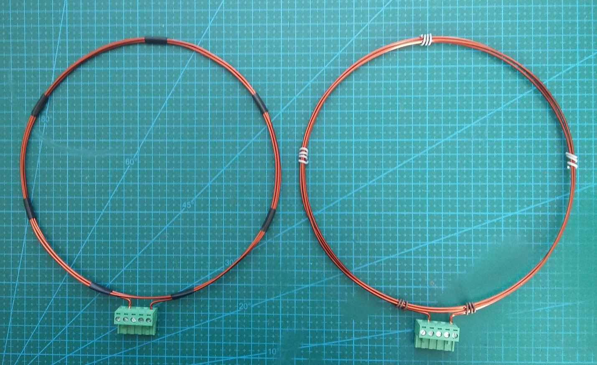
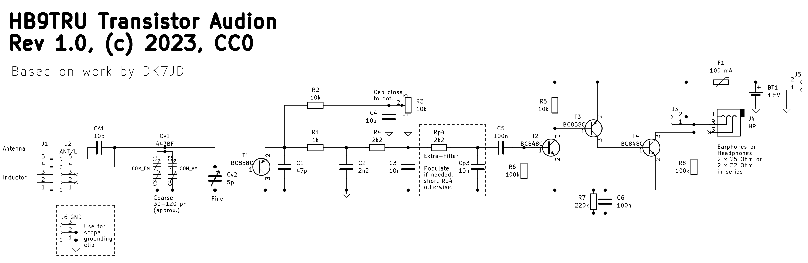

# Introduction

Shortwave radio, in the frequency range of 3 to 30 MHz (100 to 10 m wavelength), has lost popularity with the advent of the modern digital communication means, which are much more powerful as to the available information-carrying capacity. Nevertheless, shortwave radio has an unbeatable advantage over Internet & Co, in that it does not depend on external network resources. Shortwave radio enables global, direct point-to-point communication, which remains available when everything else fails. This is the principal reason why shortwave radio is still appreciated and used today for communication with ships and aircrafts, for world-wide commercial radio stations, as well as by the radio amateurs, who enjoy the use of certain frequency bands for their world-wide private talks.

**The present project is aimed at sensitising the public to shortwave radio.** It presents a simple-to-build and nevertheless extremely sensitive radio receiver, which can be tuned, by the choice of an appropriate, user-made coil (an experimental part!), to about every place in the shortwave- and mediumwave-radio bands. The receiver is an ***Audion*** circuit, which operates on commercially available 2 x 25 Ohm to 2 x 32 Ohm headphones or earphones, and which is powered by a single AAA cell of 1.2 V to 1.5 V voltage; these components are not critical. It is operated by merely two control knobs, noteworthy the frequency dial knob (to the left in the image, associated with a small “frequency loupe” below it) and the sensitivity regulator (to the right in the image).

The circuit relies on a two-sided PCB (the reverse side is on ground potential and serves for screening off erratic signals which would perturbate the correct functioning of the receiver), whereupon the smaller components are soldered in surface-mount-technology (SMT), using surface-mounted devices (SMD) and the larger components by through-hole-mounting (THM). Most of its components are electronic standard parts, except a few of them which are further explained below.

The frequency-determining element of the receiver is a single **LC-circuit**, consisting of a user-made coil and a built-in variable capacitor. The coil is connected to the receiver via a standard 5.08 mm 5-pin terminal-block connector (soldered socket & screw-connector plug). This allows the user to experiment and to make his own coils, corresponding to the radio bands he wants to receive (a band change corresponds to a coil change), as well as to connect an external antenna. Large-diameter coils act furthermore as antennas for magnetic fields, so that radio reception is possible with them alone, without connecting an external antenna. Details on making the coil are given further below.

Gerbers and other relase files are available on the [release page](https://github.com/USKA-FOS/HB9TRU-Transistor-Audion/releases). You will also find a BOM there to order parts from [LCSC](https://www.lcsc.com/). It may be more economical to order the common parts in volume. Note that in addition to the parts on the LCSC BOM, you also need:

- [Variable capacitor CBM-443BF](https://www.aliexpress.com/item/1005005349265750.html). (CBM-433DF with a moderately higher capacity also works; the exact capacity is not critical). These capacitors have four built-in variable-capacitor-packets, 2 for AM and 2 for FM; they were formerly used in Japanese-type transistor radios. They are still available, e.g. on AliExpress. Dials with screw for these parts are also available, e.g., on AliExpress. In the present project, we connect each an AM and an FM capacitor-packet together in parallel, and then both so combined packets together in series. The resulting variable capacitor scans a range of approximately 25pF to 100pF, which is quite suitable for the present project.
- [Variable 6 pF trimmer capacitor](https://www.aliexpress.com/item/32845044847.html). The 6 pF trimmer capacitor for the frequency loupe is a Murata TZC3Z060A110A, which is actually out of production, but still commercially available in large quantities, e.g. on Aliexpress and at Mouser. A template for a knurled knob is available in the `contrib` directory for laser cutting it out of 1 mm thick plywood or Pertinax laminate. The cut-out knob can then be put onto the central screw of the soldered trimmer capacitor and fixed on it with a drop of Loctite glue.
- [Knob for the sensitivity pot](//www.aliexpress.com/item/33028853050.html): for D-shaped short shaft with 6mm diameter, as commercially available.
- Coil antennas (see next paragraph).

# Antennas

Coil antennas can be wound from insulated 1.5 mm copper wire e.g. as shown in the image above. For this purpose, lacquer-insulated “magnet wire”, as used for motor windings, or simply PVC-insulated 1.5 mm² electric installation wire can be used. In the example below, for a 40m-band antenna coil, 170 cm of wire are cut off and bent into a 3-turns coil. The coil is provisionally fixed in circular form with some pieces of jumper-wire, wound around its windings, and both coil ends are then bent out at 90°, denuded of insulation, and fixed into positions 1 and 4 of the screw-connector plug. The shape of the coil is then readjusted, and the coil is finally fixed with insulation tape.

Coils with larger or smaller diameters, and with more or fewer turns, can be made in this way. If the coil serves as an antenna, the largest possible diameter gives the best receiving performance, but the coil becomes also less handy. You probably want to opt for a compromise between coil size and receiver sensitivity. During reception, the coil should not move or rattle, in order to keep the receiving frequency stable. This is important when receiving CW or SSB stations, i.e. radio amateur emissions.

An external wire antenna (about 5 m to 10 m, or even longer) can also be connected at position 5 of the screw-connector plug. This has an advantage in electrically silent environments. In electrically polluted (i.e. urban) environments, or inside houses, a coil antenna is preferably used, because coil antennas (“magnetic field antennas”) are less sensitive to electric field pollution than wire antennas, and their directivity allows to minimise perturbations by orienting the coil appropriately. Inside houses, the best reception with a coil antenna is generally achieved close to windows. Very often, an orientation of the coil in the horizontal plane is the most favourable orientation.

# Interactive BOM

For assembly, [InteractiveHtmlBom](https://github.com/openscopeproject/InteractiveHtmlBom) was used to create a neat interactive BOM available [here](https://htmlpreview.github.io/?https://github.com/USKA-FOS/HB9TRU-Transistor-Audion/blob/main/iBOM/ibom.html).

# Circuit and theory of operation

The _Transistor Audion_ consists of the _Audion_ circuit proper, around T1, to the left side of the circuit schematic, and a three-stage AF-amplifier, based on a chain of complementary transistors T2, T3, and T4, to the right side of the circuit schematic. The circuit is based on work by Burkhard Kainka, DK7JD, who published it on his [web page](https://www.b-kainka.de/) (direct link to the project [here](https://www.b-kainka.de/bastel117.htm)).

It is essentially a _Colpitts oscillator_ in common-collector circuit. To see this, you have to add the transistor’s intrinsic base-emitter capacitance CBE to the circuit schematic. This capacitor is in series with C1, and the whole is parallel to the variable capacitor of the LC resonant circuit (“tank circuit”). Through the 10k resistor R2, the emitter is connected to an adjustable potential generated by R3. For audio frequencies C4 (10 uF) connects the emitter-side of R2 to ground potential. At high frequencies, only the 1k resistor R1, connected to ground by the 2n2 capacitor C2, acts as the output working resistor. At audio frequencies, however, the 10k resistor R2 acts as the output working resistor. This fact must be accounted for when designing the audio filters.

The _Colpitts oscillator_ in common collector circuit is characterized by a very smooth onset of the oscillations at the critical base-emitter potential. Hence, by adjusting R3, the damping of the resonant LC circuit can be gradually removed, increasing the _Audion’s_ sensitivity and selectivity to incoming radio waves. R3 can also be used to diminish the audible intensity when receiving too strong AM stations. AM signals, which contain a carrier and one or two information-containing sidebands, are inherently demodulated at the nonlinear base-emitter diode of T1, and are then available at the emitter resistance R2.

For receiving emissions in CW or SSB, the _Audion_ is put into its self-oscillation regime by adjusting R3 beyond the point of onset of the oscillations, so as to obtain a sufficiently strong carrier-replacement BFO signal. In T1, the now available local oscillator (BFO) mixes with the received CW or SSB signals to produce an audible output. Care must be taken to keep the receiver coil mechanically stable, and to place the BFO frequency on the correct side of and distance to the SSB signal. This requires tact, because we are dealing here with some 10 Hz! Hence, use the _frequency loupe_, and sometimes even the sensitivity knob (which acts on the CBE capacity, too) to obtain a perfect adjustment when receiving SSB signals.

The audio signal passes three successive low-pass filters (R2-C2, R4-C2, and Rp4-Cp4). Each filter is designed with a corner frequency of 7.2 kHz in order to remove any trace of remaining high-frequency, which would block the entry of the following audio amplifier, in particular when receiving SSB or CW signals, where the _Audion_ is oscillating.

The three-stage amplifier is a pnp-npn-pnp _daisy-chain_ of complementary, high-beta transistors. Its operating point is adjusted through an RC feedback network consisting of R6, C6, R7, and R8, so as to set its quiet output potential to half of the supply voltage (0.7 to 0.8 V). The current amplification (beta) of each transistor is around 500, and the quiescent output current to a 50 Ohm load is 15 mA at 1.5V supply voltage. The output transistor T4 is directly driven by the collector of T3, which is a current source. T4 works therefore in a linear regime, controlling the current through the headphones or earphones, which are also forced to linear regime. T2 and T3 work in small-signal regime (ΔU/Vth = ΔU/26mV << 1) and are thus linear as well. A collector resistance of 10k (R5) has been added at T2, in order to lower its input resistance.

# Assembly
Assembly of the _Transistor Audion_ is straightforward. First, all SMD parts are soldered onto the PCB. To this purpose, a soldering iron having a point-shaped tip and temperature control (320°C), a pair of point-shaped electronic tweezers, and 0.3 mm or 0.5 mm flux-cored soldering wire are required. A 10 % solution of rosin in isopropanol, a good working loupe or a binocular loupe, a paper cutter, a desoldering pump, and a tweezer-shaped impedance meter are helpful too (but not necessarily required), as well as a clean and clear table surface. SMD components are soooo small...

SMD components are supplied in reel form, i.e. each individual component is contained in a small cavity in a tape on a reel, and the cavity is covered with a plastic foil. 0805 components are 2 mm x 1.25 mm in size, at varying thickness, depending on the component. When purchasing SMD components, one obtains parts (cut strips) of such tape/reel.

The minimalist’s way to assemble the circuit is to first paint the surface of the PCB, where the components are to be soldered on, with the 10 % rosin solution and to let it dry. Then, one by one, open the SMD component’s cavities by taking off the plastic foil with the paper cutter and the tweezers. Take the SMD component out, and hold it with the tweezers, feet down, in correct position onto the PCB (you need some dexterity in both your hands for doing so), and take, with your other hand, a small drop of solder from the 0.3 mm or 0.5 mm solder wire onto the tip of your soldering iron and shortly tip with it onto a first foot of your SMD component. Soldered! Now, do the same for the second foot (and the further feet) of your SMD component. Proceed on until all SMD components are soldered on.

Now solder in the classical, “through hole” components. For this purpose, free them first, if needed, from all screwed-on or pushed-on accessories, to get them as handy as possible. Then use 1 mm flux-cored soldering wire. First bend the 6 connecting leads of the variable capacitor downwards in L-shape, and shorten them appropriately, so as to fit the 6 “landing pads” on the PCB. Solder the variable capacitor tightly onto the six “landing pads”, which serve also for fixing the variable capacitor to the PCB. Now solder tighly in the right-angle Terminal Block connector socket (to this aim, solder a first contact, then, remelting the solder, push the socket tightly onto the PCB and let harden the solder. Then solder the remaining contacts). Then solder in the AAA battery holder (pay attention to the polarity side!), and cut off the excessive connecting wires. Finally solder in the Headphones/Earphones jack and the 10K potentiometer (its insertion into the PCB is somewhat hard; just gently push, exerting the necessary force).

To finish the assembly, screw the large dial onto the variable capacitor, and set on the knurled knob onto the central screw of the trimmer capacitor and fix it there with a drop of Loctite. Put as well the potentiometer knob onto the D-shaped shaft, and plug in a coil.

# Operation
Insert a AAA-battery or cell, and plug in a pair of earphones or headphones of 2 x 25 Ohm or 2 x 32 Ohm impedance, as well as the coil for the desired frequency range. Set the frequency dial to the low-frequency end (left). From the minimum position (to the left) increase the sensitivity, until you hear a sudden increase of the background noise. This is the onset of the oscillator. Now slowly scan with the frequency dial through the band. At some points you hear “blips”, i.e. HF-carriers, or distorted voices. This may be an AM station. Reduce the sensitivity to the point where the oscillations vanishes. You may now tune in the AM station, as well as the stations surrounding it, if there are such. You may need to iteratively adjust the frequency dial and the sensitivity pot, because the onset of the oscillations varies somewhat with the frequency. For receiving weak AM stations, you may need to move the sensitivity pot very slightly into the oscillation regime, where you hear a strong whistle due to the presence of the carrier signal. Fine-tune now the frequency to make coincide your BFO with the carrier of the AM station; the BFO will then synchronize with the carrier and you only hear the demodulated AM signal.

For receiving CW or SSB stations, move the sensitivity pot somewhat farther into the oscillation regime, such that your BFO no longer synchronizes with the carrier. You may now set your frequency dial aside a CW signal or aside an SSB signal, to listen to the transmission. Radio amateurs use Lower Sideband modulation (LSB) on the lower bands (up to including 40m), and Upper Sideband modulation (USB) on the higher bands (from 30m upward, i.e. 20m, 15m, etc.). For the demodulation of LSB, the BFO must be set slightly above the signal, and adjusted so as to avoid “Mikey Mouse” (BFO too high) or scrambled voices (BFO too low). For the demodulation of USB, the BFO must be set slightly below the signal, and adjusted accordingly. Given that the filter of the present receiver is quite wide (7.2 kHz above and below the BFO) one often hears other stations in “Mikey Mouse” or scrambled voices along with the desired station. It is also quite frequent that one only hears one part of a radio amateur conversation, because you may have good radio propagation to one of the two stations only. Propagation conditions on shortwaves are often unstable; they noteworthy depend on the sun radiation and on other factors; hence, if you have heard one station speaking, just wait and listen, whether the other one comes up, too, on the same frequency. Sometimes there are also multiple stations conversing on the same frequency simultaneously.

The best sites for shortwave reception are mountain tops. So, you might be tempted to try out your receiver on a hike to a mountain top. The “day-bands” are from 5 MHz upwards (including the 20 m and the 15 m amateur bands). During night, the lower frequencies propagate well; the “night-bands” are from 1 MHz to about 12 MHz (including the 160 m and the 80 m amateur bands). Between 5 MHz and 12 MHz are the “day-and-night-bands” (many commercial radio bands, and noteworthy the 40m and the 30m amateur bands). A detailed list of [Commercial](https://en.wikipedia.org/wiki/Broadcast_band) and [amateur radio bands](https://en.wikipedia.org/wiki/Amateur_radio_frequency_allocations#Band_characteristics) can be found, e.g., on Wikipedia (using the aforementioned hyperlinks.

# License

This project was created using [KiCad](https://www.kicad.org/) version 6.0.11 and is released in the public domain under the CC0 license.
